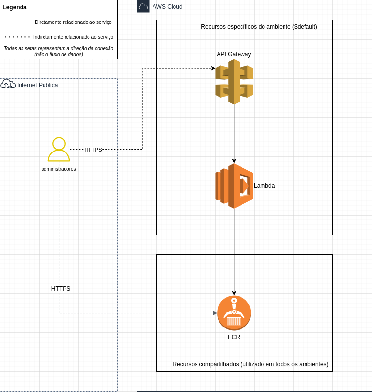

# Contêiner em ambiente serverless com AWS Lambda

## Introdução

Optei por dockerizar a aplicação e utilizar o AWS Lambda para executar o contêiner. Para prover o acesso a API, utilizei o API Gateway da AWS. Tendo como resultado o seguinte e diagrama:



## Pré-requisitos

- [AWS CLI](https://docs.aws.amazon.com/pt_br/cli/latest/userguide/cli-chap-install.html)
- [Docker](https://docs.docker.com/get-docker/)
- Credenciais da AWS com permissão `AdministratorAccess`
  > **Note**
  >
  > Tais previlégios apenas para fins de teste. Em um cenário real, seria necessário criar um usuário com permissões mais restritas.


## Preparando o ambiente

1. Criar usuário no AWS IAM com permissão `AdministratorAccess` e liberar acesso programático.

2. Copiar o arquivo `.env.example` para `.env` e preencher as variáveis de ambiente. As variáveis `AWS_ACCESS_KEY_ID` e `AWS_SECRET_ACCESS_KEY` são as credenciais do usuário criado no passo anterior. A variável `AWS_DEFAULT_REGION` é a região onde os recursos serão criados. A variável `AWS_ACCOUNT_ID` é o ID da conta da AWS.

    ```bash
    cp .env.example .env
    ```

3. Carregue as variáveis de ambiente no terminal atual.

    ```bash
    source .env
    ```

## Disponibilizando a imagem Docker no ECR

1. Crie uma imagem docker da aplicação.

    ```bash
    docker build -t ${AWS_ACCOUNT_ID}.dkr.ecr.${AWS_DEFAULT_REGION}.amazonaws.com/varsomics-api:latest . -f Dockerfile
    ```

2. Realize o login no ECR.

    ```bash
    aws ecr get-login-password --region ${AWS_DEFAULT_REGION} | docker login --username AWS --password-stdin ${AWS_ACCOUNT_ID}.dkr.ecr.${AWS_DEFAULT_REGION}.amazonaws.com
    ```

3. Crie um repositório no ECR.

    ```bash
    aws ecr create-repository --repository-name varsomics-api
    ```

4. Envie a imagem para o ECR.

    ```bash
    docker push ${AWS_ACCOUNT_ID}.dkr.ecr.${AWS_DEFAULT_REGION}.amazonaws.com/varsomics-api:latest
    ```

## Executar e prover o acesso ao contâiner em um piscar de olhos

1. No console da AWS, crie uma função Lambda sendo que o tipo de execução é `Container image`.
   1. Defina um nome para a função;
   2. Em `Container image URI`, utilize a busca para seleciona a imagem enviada ao ECR;
   3. Clique em criar função;
   4. Após a criação, navegue até a aba `Configuration` e acesse a opção `Environment variables`;
   5. Adicione as variáveis de ambiente `ADMIN_USER` e `ADMIN_PASS` com os valores desejados;
   6. Retorne para a aba `Image` e faça o deploy de uma nova imagem. Isso irá reiniciar a função e carregar as variáveis de ambiente.

2. Ainda no console da AWS, crie um API Gateway para a função Lambda criada no passo anterior (8).
   1. Clique em `Create API`;
   2. Selecione `HTTP API`;
   3. Adicione uma integração com o a função Lambda criada no passo anterior (8);
   4. Defina um nome para a API;
   5. Configure a rota principal, sendo ela:
      1. Méthod: `GET`;
      2. Resource path: `/`;
   6. Crie a API Gateway.

3. Acesse a URL da API Gateway criada no passo anterior (9) e teste a aplicação utilizando as credenciais definidas na variável de ambiente `ADMIN_USER` e `ADMIN_PASS`.
